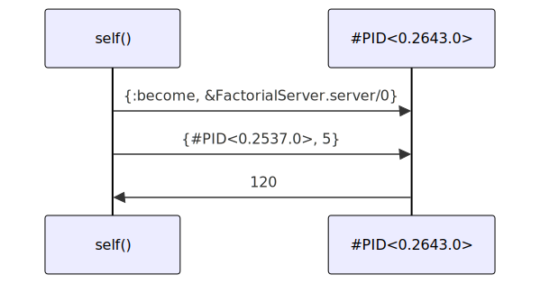

# My favorite Erlang Program by Joe Armstrong in Elixir

In [this blog post](https://joearms.github.io/published/2013-11-21-My-favorite-erlang-program.html) Joe Armstrong walks through a simple example of Erlang code to demonstrate the power and simplicity of Erlang processes.

This Livebook translates the code to Elixir.

